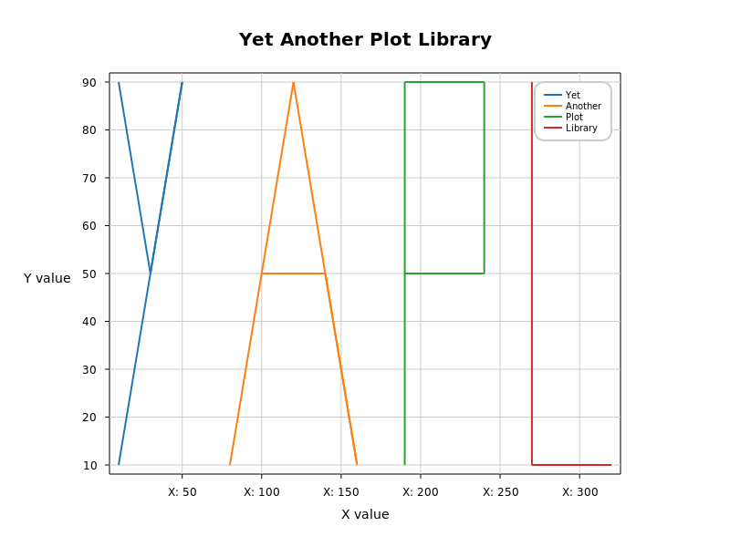

# Yet Another Plot Library
This is my attempt to create simple plot library for `C++`. Especially one that is willing to work on `Raspberry Pi` devices on `arm64` OS. 

> [!NOTE]
> This library will not display any plots. It can only save them to `.png`

## But Why?
Why to choose this library when you can use `python` and all it goodness like `matplotlib`?

Well.. I also do not know. But maybe when writing somethig that need to work without any other programs like amazing `gnuplot`, running on constrained hardware resources system maybe it is worth checking out on this something.

## Example

```cpp
#include "yapl.hpp"
#include <iostream>

int main() {
    try {
        yapl::Plot plot;
        plot.addData({1, 2, 3, 4, 5, 6, 7, 8, 9, 10}, {10, 20, 30, 20, 10, 20, 30, 20, 10, 20});
        plot.xLabel("X value");
        plot.yLabel("Y value");
        plot.title("Plot title");
        std::cout << "Saving plot" << std::endl;
        plot.save("my_plot.png", 800, 600);
    }
    catch (const yapl::Exception& e) {
        std::cout << "Caught error during plot generation" << std::endl;
    }
    return 0;
}
```

## Dependencies
- [cario](https://www.cairographics.org/)

## License
This software is released under `GPLv2+` license.